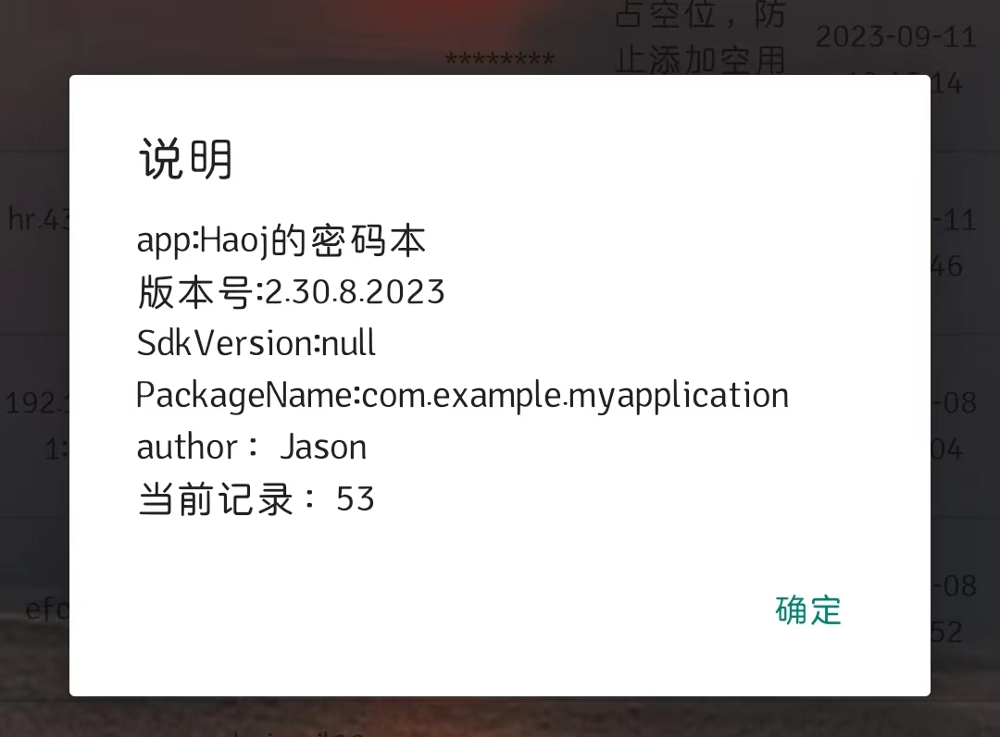
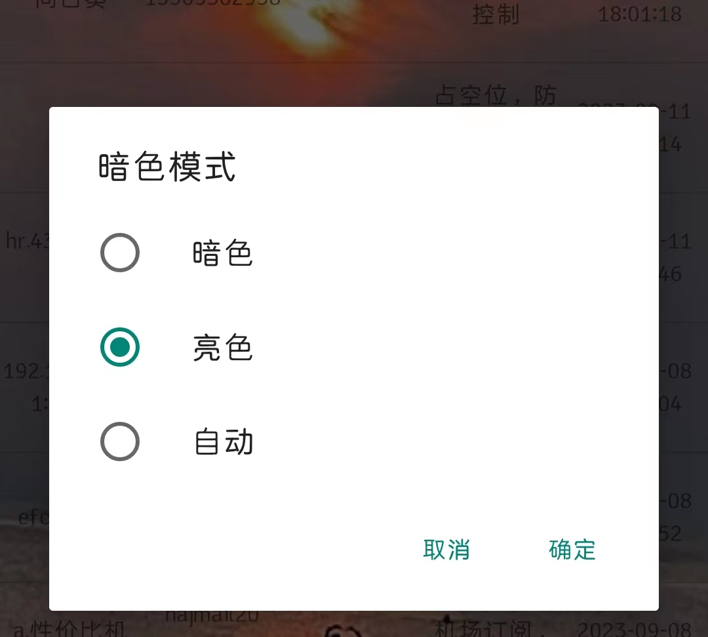
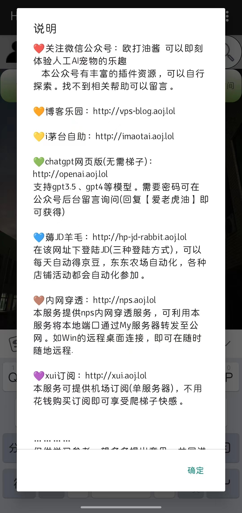

# 简易密码本

---

## 更新

- 密码存入数据库时加密，直接读取数据库文件无法直接获取密码信息，需解密才可以看到
- 显示每次查询数据条数
- 多功能界面早已更新

---

>

## 初衷

现代生活花花绿绿，一个人含有太多的“身（账）份（号）”，一个网站一个“身份”，一个用户一个“身份”，“身份”多了，总不能想起自己对应的“角（密）色（码）”。

该密码本的作用其一是及时记录新注册的账号密码，以及备注信息（说明性内容）；其二就是账号密码数量很多后，不能及时找到想要的账号密码，这就引出搜索功能，根据“关键字（词）”，及时找到想要的“身份”。

## 主功能

- 新增个人账号密码等信息；（官网信息、用户名、密码、备注）
- 搜索信息（可以输入官网，用户名、密码、备注信息进行模糊搜索）
- 左滑功能

- 导出以存储的数据
- 导入已有的数据
- 更换背景图片

**需要给文件存储权限**

**无联网功能，不担心密码泄露**

## 主界面

## 新增用户密码

可以添加官网、用户名、密码和备注四大信息，保存后会在主界面显示添加账号的时间，方便查看修改的信息。

## 搜索功能

可以输入官网信息、用户名、密码以及备注信息进行模糊查询

## 左滑功能

支持修改、查看密码和删除功能

## 修改密码

## 导出、导入数据

## About

<<<<<<< HEAD

=======

>>>>>>> 41d37a9d5c9edb1527e726d5a05dac758192a364

## 系统颜色

可以跟随Android系统的亮色/暗色模式；

也可以自定义颜色

<<<<<<< HEAD

=======

>>>>>>> 41d37a9d5c9edb1527e726d5a05dac758192a364

## 说明

内置多个好玩、好用项目，自行挖掘吧！

